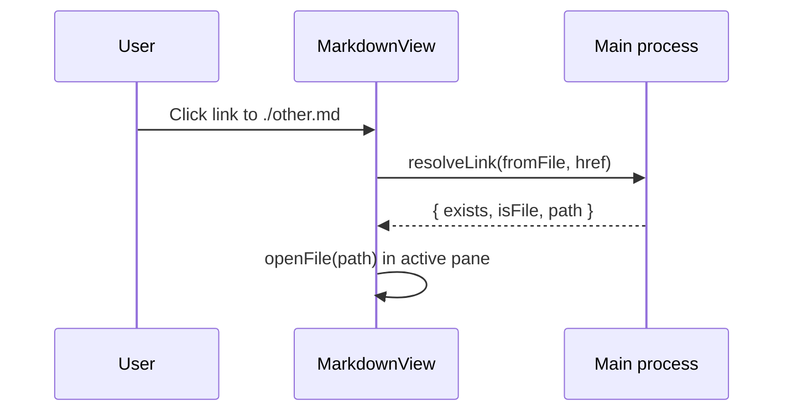
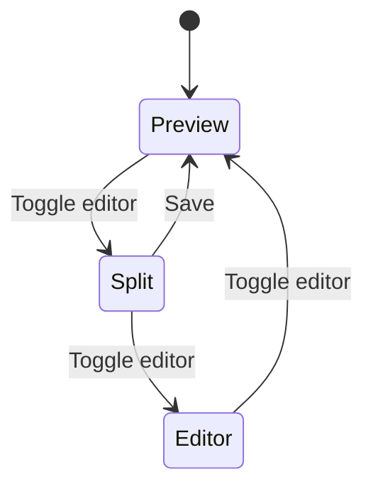

# Diagrams in Markdown

A sequence diagram describing how opening a referenced file works:

```mermaid
sequenceDiagram
    participant U as User
    participant V as MarkdownView
    participant M as Main process
    U->>V: Click link to ./other.md
    V->>M: resolveLink(fromFile, href)
    M-->>V: { exists, isFile, path }
    V->>V: openFile(path) in active pane
```

A state diagram:

```mermaid
stateDiagram-v2
    [*] --> Preview
    Preview --> Split: Toggle editor
    Split --> Editor: Toggle editor
    Editor --> Preview: Toggle editor
    Split --> Preview: Save
```

Back to [the welcome page](./welcome.md).
