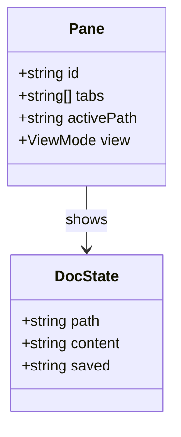

# Feature Notes

This file lives in a subfolder to demonstrate recursive folder scanning and
relative links that traverse directories.

- Back to [welcome](../welcome.md)
- Jump to [architecture](../architecture.mmd)

## Class diagram

