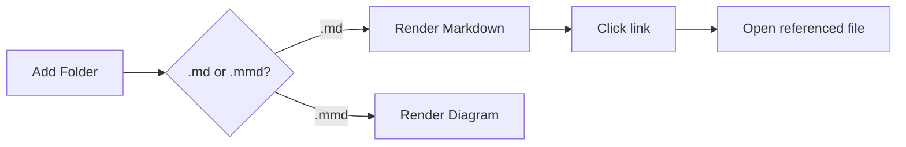

# Welcome to MDReader

This is a sample Markdown file to exercise the viewer. Try the features below.

## Cross-file links

MDReader resolves links to other local files and opens them in the active pane:

- [Open the architecture diagram](./architecture.mmd)
- [Open the feature notes](./features/notes.md)
- [Open a Mermaid flow inside markdown](./diagrams.md)

External links open in your system browser: [Mermaid docs](https://mermaid.js.org).

## Inline Mermaid

A fenced ` ```mermaid ` block renders as a diagram:



## GitHub-flavored Markdown

| Feature            | Supported |
| ------------------ | :-------: |
| Tables             |    ✅     |
| Task lists         |    ✅     |
| Mermaid (.md/.mmd) |    ✅     |

- [x] Add folders
- [x] Render `.mmd`
- [x] Open referenced files on click
- [ ] Your next note

> Tip: toggle **Split** in the pane toolbar to edit and preview side by side,
> then press **Ctrl/Cmd+S** to save (a snapshot is added to History).
